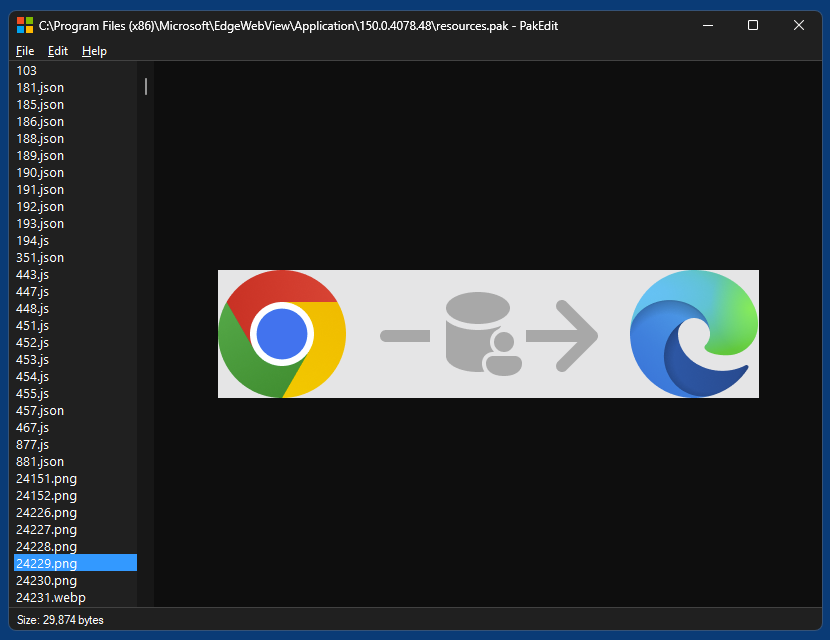

# PakEdit

PakEdit is a simple viewer and editor for `.pak` resource files of Chromium-based browsers (Chrome/Chromium/Edge/WebView2/Brave).

It is based on [Microsoft Edge WebView2](https://developer.microsoft.com/en-us/microsoft-edge/webview2) and native [Windows controls](https://learn.microsoft.com/en-us/windows/win32/controls/individual-control-info) and written in Python. It's a showcase app for WebView2 Python binding [WebView2-for-Python](https://github.com/59de44955ebd/webview2-for-python) and Windows 11 only.

*PakEdit running in Windows 11 (dark mode)*

## Usage

After loading a `.pak` file all resources are displayed in a listbox on the left. When selecting a resource, it is shown in a webvieb on the right, either as media preview (for images, vector graphics, animations and videos), as editable text (for `.css`, `.html`, `.js`, `.json` and string resources) or as hex view (for unidentified binary resources).

Editable text resources can be edited directly inside the application. Binary resources can be exported (via context menu "Export and reveal" or double-click) to a temporary directory and then edited with some external media editor or replaced with a different file (but same filename).

After some resources were edited a new `.pak` file can be saved (menu `File` -> `Save as...`). All resources in the new file will use the same compression as in the original file.

PakEdit also supports searching for a known string in text resources (`.css`, `.html`, `.js`, `.json`).

## Supported media types for preview

* avif
* jpeg
* lottie (JSON)
* mp4
* png
* svg
* webp

## Notes

* PakEdit is meant for recent versions of Brave/Chrome/Chromium/Edge/WebView, and therefor only supports PAK version 5. I actually couldn't find any version 4 `.pak` file at all, I guess they don't exist anymore since at least 10 years.

* There is no `Save`, but only `Save as...`, because the process of saving as new `.pak` file depends on the original file, and therefor it can't be directly overwritten.

* If you only want to export media from an existing `.pak` file, copy the exported resources from the temporary directory to some other directory before closing the application, because this temporary directory is erased when the application is closed.
